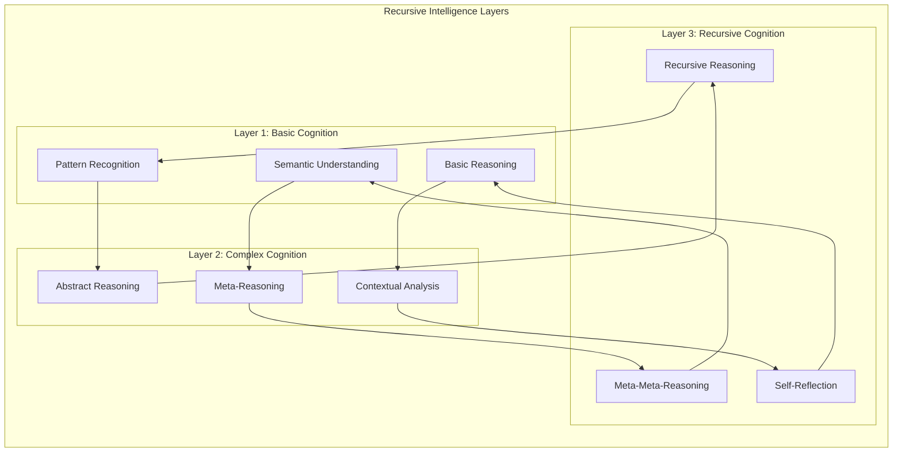
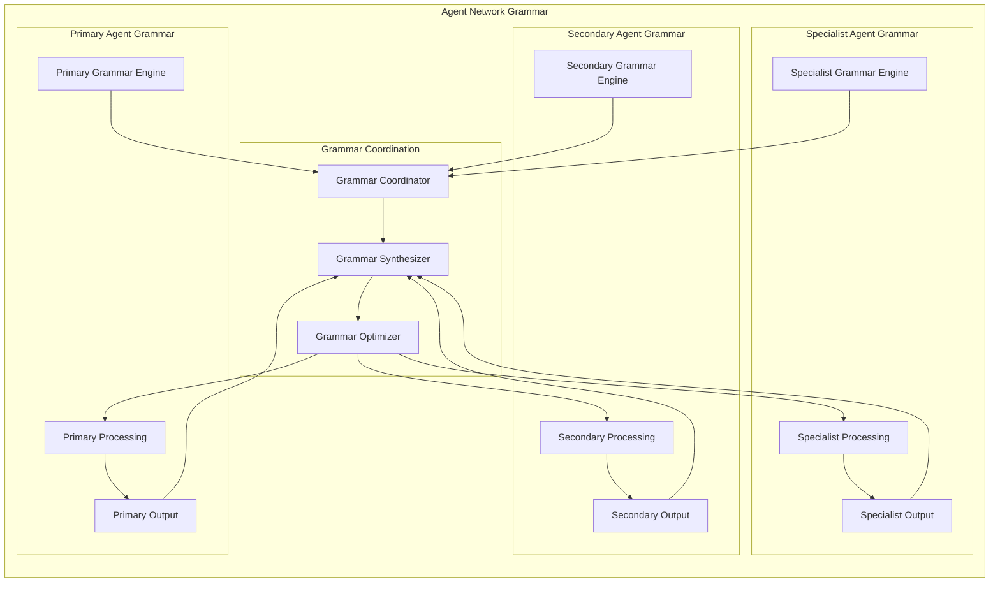
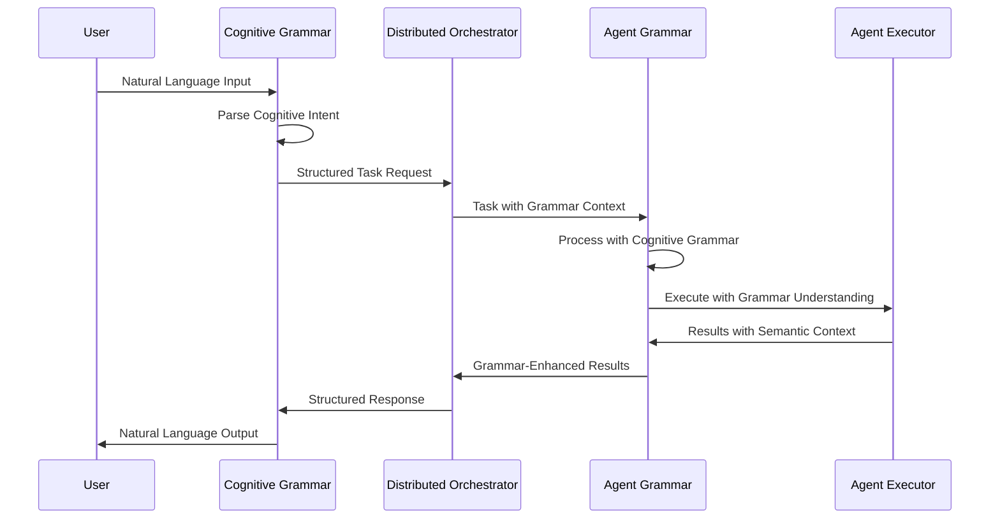
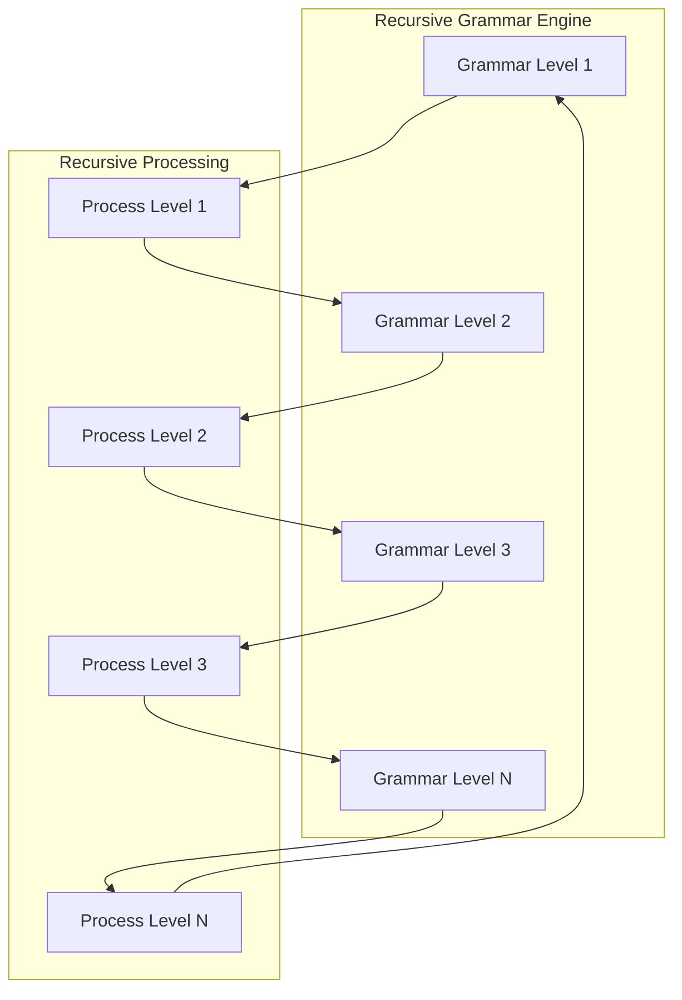
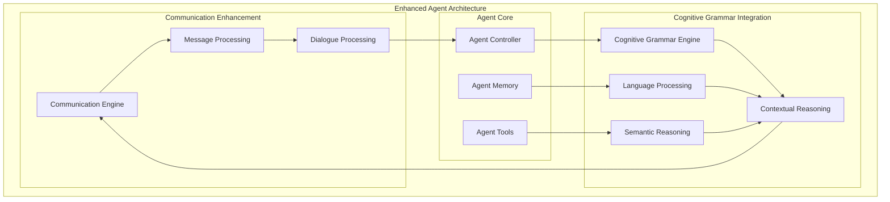

# Agentic Cognitive Grammar - The Foundation of Intelligence

## Overview

The Agentic Cognitive Grammar system represents the pinnacle of linguistic artificial intelligence, implementing sophisticated cognitive processing capabilities that enable agents to understand, reason, and communicate with unprecedented sophistication.

## Core Architecture

### Cognitive Grammar Engine

```mermaid
graph TB
    subgraph "Cognitive Grammar Core"
        subgraph "Input Processing"
            NL[Natural Language Input]
            LP[Lexical Processing]
            SP[Syntactic Parsing]
            SEM[Semantic Analysis]
        end
        
        subgraph "Cognitive Processing"
            CM[Cognitive Mapping]
            CR[Contextual Reasoning]
            PR[Pragmatic Reasoning]
            IR[Inferential Reasoning]
        end
        
        subgraph "Grammar Generation"
            GG[Grammar Generation]
            SR[Structural Reasoning]
            OR[Output Reasoning]
            LG[Language Generation]
        end
        
        subgraph "Distributed Intelligence"
            DI[Distributed Integration]
            AC[Agent Communication]
            KC[Knowledge Coordination]
            MC[Memory Coordination]
        end
    end
    
    NL --> LP
    LP --> SP
    SP --> SEM
    
    SEM --> CM
    CM --> CR
    CR --> PR
    PR --> IR
    
    IR --> GG
    GG --> SR
    SR --> OR
    OR --> LG
    
    LG --> DI
    DI --> AC
    AC --> KC
    KC --> MC
    
    MC --> CM
```



### Recursive Cognitive Processing



## Advanced Features

### Distributed Cognitive Grammar Network



### Cognitive Grammar Integration with Orchestration



## Implementation Details

### Core Components

#### 1. Lexical Processing Engine
- **Pattern Recognition**: Advanced pattern matching for linguistic structures
- **Semantic Mapping**: Sophisticated meaning extraction from text
- **Contextual Analysis**: Deep understanding of situational context

#### 2. Syntactic Parser
- **Grammar Rule Engine**: Comprehensive grammar rule processing
- **Structural Analysis**: Deep syntactic structure understanding
- **Dependency Parsing**: Advanced dependency relationship analysis

#### 3. Semantic Analyzer
- **Meaning Extraction**: Sophisticated semantic understanding
- **Concept Mapping**: Advanced concept relationship analysis
- **Ontological Reasoning**: Deep ontological understanding

#### 4. Pragmatic Processor
- **Intent Recognition**: Advanced intent understanding
- **Context Integration**: Sophisticated context-aware processing
- **Conversational Reasoning**: Advanced dialogue understanding

### Advanced Capabilities

#### Recursive Grammar Processing



#### Distributed Grammar Coordination

The system implements sophisticated coordination between multiple grammar engines:

1. **Grammar Synchronization**: Ensures consistent grammar interpretation across agents
2. **Semantic Coordination**: Coordinates semantic understanding between agents
3. **Contextual Sharing**: Shares contextual information across the agent network
4. **Pragmatic Alignment**: Aligns pragmatic understanding across agents

### Integration with Agent Zero

#### Agent Enhancement



## Usage Examples

### Basic Grammar Processing

```python
from python.helpers.cognitive_grammar import CognitiveGrammarEngine

# Initialize the grammar engine
grammar = CognitiveGrammarEngine()

# Process natural language input
result = grammar.process("Create a comprehensive analysis of market trends")

# Extract semantic structure
semantic_structure = grammar.extract_semantics(result)

# Generate agent instructions
instructions = grammar.generate_instructions(semantic_structure)
```

### Advanced Recursive Processing

```python
from python.helpers.cognitive_grammar import RecursiveGrammarProcessor

# Initialize recursive processor
processor = RecursiveGrammarProcessor()

# Process with recursive depth
result = processor.process_recursive(
    input_text="Develop a strategy for optimizing distributed systems",
    max_depth=3,
    enable_meta_reasoning=True
)

# Extract recursive insights
insights = processor.extract_recursive_insights(result)
```

### Distributed Grammar Coordination

```python
from python.helpers.cognitive_grammar import DistributedGrammarCoordinator

# Initialize coordinator
coordinator = DistributedGrammarCoordinator()

# Coordinate grammar across agents
coordination_result = coordinator.coordinate_grammar(
    agents=["research_agent", "development_agent", "analysis_agent"],
    task="Comprehensive system analysis",
    grammar_context="technical_analysis"
)
```

## Performance Characteristics

### Optimization Features

1. **Parallel Processing**: Distributed grammar processing across multiple agents
2. **Caching**: Intelligent caching of grammar structures and semantic mappings
3. **Lazy Evaluation**: Lazy evaluation of complex grammar structures
4. **Memory Management**: Advanced memory management for large grammar trees

### Scalability

The system scales gracefully with:
- **Agent Network Size**: Supports large networks of agents
- **Grammar Complexity**: Handles complex recursive grammar structures
- **Processing Load**: Distributed processing for high-throughput scenarios
- **Memory Usage**: Efficient memory usage for large-scale deployments

## Future Enhancements

### Planned Improvements

1. **Enhanced Recursive Processing**: Deeper recursive grammar analysis
2. **Advanced Semantic Understanding**: More sophisticated semantic processing
3. **Improved Context Awareness**: Better contextual understanding
4. **Performance Optimizations**: Further performance improvements
5. **Extended Language Support**: Support for additional languages

### Vision for Excellence

The Agentic Cognitive Grammar system represents the future of linguistic artificial intelligence, providing unprecedented capabilities for understanding, reasoning, and communication. Through sophisticated engineering and innovative design, we have created a system that truly understands language at the deepest levels, enabling agents to communicate and reason with human-like sophistication.

This living tapestry of linguistic intelligence continues to evolve, with each interaction contributing to the ever-growing understanding of natural language and human communication. The system stands as a testament to the incredible possibilities when advanced artificial intelligence meets sophisticated linguistic processing.