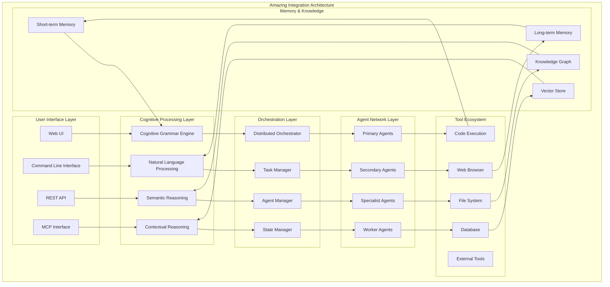
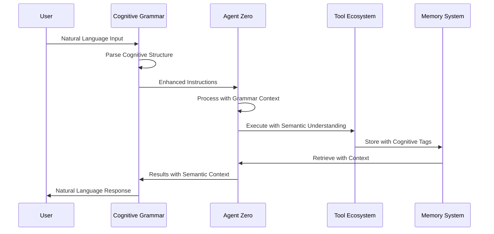
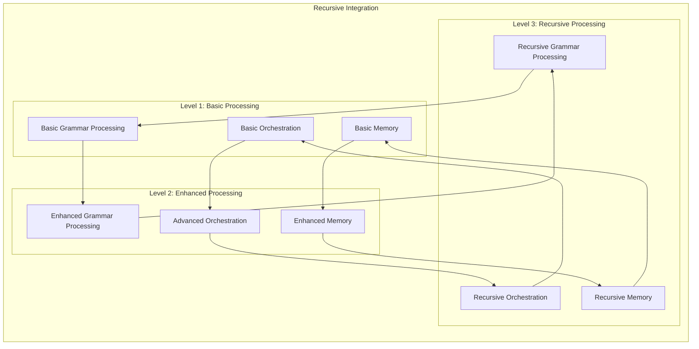
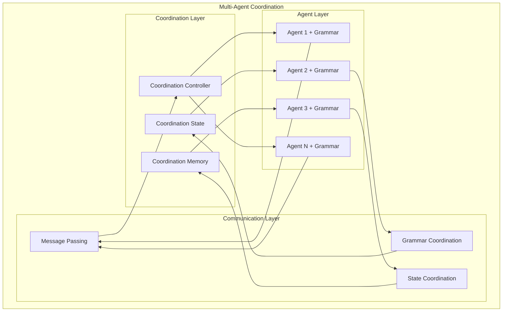

# Integration Guide - Making Everything Amazing

## Overview

This guide provides comprehensive instructions for integrating and utilizing the distributed network of agentic cognitive grammar within the Agent Zero framework, creating masterpieces of breathtaking beauty in artificial intelligence.

## System Integration Architecture

### Complete Integration Flow



## Integration Components

### 1. Cognitive Grammar Integration

#### Core Integration Points



#### Implementation Example

```python
# Example of integrating cognitive grammar with Agent Zero
from agent import Agent
from python.helpers.cognitive_grammar import CognitiveGrammarEngine
from python.helpers.distributed_orchestrator import get_orchestrator

class EnhancedAgent(Agent):
    def __init__(self, *args, **kwargs):
        super().__init__(*args, **kwargs)
        self.cognitive_grammar = CognitiveGrammarEngine()
        self.orchestrator = get_orchestrator()
    
    async def process_with_grammar(self, user_input):
        # Parse input with cognitive grammar
        parsed_input = self.cognitive_grammar.parse(user_input)
        
        # Extract semantic structure
        semantic_structure = self.cognitive_grammar.extract_semantics(parsed_input)
        
        # Generate enhanced instructions
        instructions = self.cognitive_grammar.generate_instructions(semantic_structure)
        
        # Process with orchestration
        if self.orchestrator.should_orchestrate(instructions):
            result = await self.orchestrator.process_distributed(instructions)
        else:
            result = await self.process_standard(instructions)
        
        # Generate response with cognitive grammar
        response = self.cognitive_grammar.generate_response(result)
        
        return response
```

### 2. Distributed Orchestration Integration

#### Agent Registration and Management

```python
from python.helpers.distributed_orchestrator import get_orchestrator
from python.api.orchestration import register_agent

async def setup_distributed_network():
    """Set up the distributed agent network"""
    orchestrator = get_orchestrator()
    
    # Register specialized agents
    research_agent = await register_agent(
        context_id="research_001",
        skills=["research", "analysis", "data_collection"]
    )
    
    development_agent = await register_agent(
        context_id="dev_001",
        skills=["coding", "development", "testing"]
    )
    
    analysis_agent = await register_agent(
        context_id="analysis_001",
        skills=["analysis", "reporting", "visualization"]
    )
    
    return [research_agent, development_agent, analysis_agent]
```

#### Task Distribution Example

```python
async def distribute_complex_task(goal, context=""):
    """Distribute a complex task across the agent network"""
    orchestrator = get_orchestrator()
    
    # Decompose the goal into atomic subtasks
    subtasks = orchestrator.decompose_goal(goal, context)
    
    # Assign tasks to capable agents
    assignments = orchestrator.assign_subtasks()
    
    # Execute tasks in parallel
    results = []
    for subtask, agent_id in assignments:
        result = await orchestrator.execute_subtask_on_agent(subtask, agent_id)
        results.append(result)
    
    # Synthesize results
    final_result = orchestrator.synthesize_results(results)
    
    return final_result
```

### 3. Memory System Integration

#### Enhanced Memory with Cognitive Grammar

```python
from python.helpers.memory import Memory
from python.helpers.cognitive_grammar import CognitiveGrammarEngine

class CognitiveMemory(Memory):
    def __init__(self, *args, **kwargs):
        super().__init__(*args, **kwargs)
        self.grammar_engine = CognitiveGrammarEngine()
    
    def store_with_grammar(self, content, context=None):
        # Parse content with cognitive grammar
        parsed_content = self.grammar_engine.parse(content)
        
        # Extract semantic tags
        semantic_tags = self.grammar_engine.extract_semantic_tags(parsed_content)
        
        # Store with enhanced metadata
        self.store({
            "content": content,
            "parsed_content": parsed_content,
            "semantic_tags": semantic_tags,
            "context": context,
            "timestamp": self.get_timestamp()
        })
    
    def retrieve_with_grammar(self, query):
        # Parse query with cognitive grammar
        parsed_query = self.grammar_engine.parse(query)
        
        # Extract semantic intent
        semantic_intent = self.grammar_engine.extract_intent(parsed_query)
        
        # Retrieve with semantic matching
        results = self.retrieve_semantic(semantic_intent)
        
        return results
```

### 4. Tool Ecosystem Integration

#### Grammar-Enhanced Tools

```python
from python.tools.code_execution import CodeExecutionTool
from python.helpers.cognitive_grammar import CognitiveGrammarEngine

class CognitiveCodeExecutionTool(CodeExecutionTool):
    def __init__(self, *args, **kwargs):
        super().__init__(*args, **kwargs)
        self.grammar_engine = CognitiveGrammarEngine()
    
    async def execute_with_grammar(self, code_request):
        # Parse code request with cognitive grammar
        parsed_request = self.grammar_engine.parse(code_request)
        
        # Extract coding intent
        coding_intent = self.grammar_engine.extract_coding_intent(parsed_request)
        
        # Generate optimized code
        optimized_code = self.grammar_engine.optimize_code(coding_intent)
        
        # Execute with enhanced context
        result = await self.execute_code(optimized_code)
        
        # Parse result with grammar
        parsed_result = self.grammar_engine.parse_result(result)
        
        return parsed_result
```

## Advanced Integration Patterns

### 1. Recursive Processing Integration



### 2. Multi-Agent Coordination



## Configuration and Setup

### 1. Environment Configuration

```python
# config.py - Enhanced configuration
class AmazingConfig:
    """Configuration for the amazing distributed system"""
    
    # Cognitive Grammar Settings
    COGNITIVE_GRAMMAR_ENABLED = True
    RECURSIVE_PROCESSING_DEPTH = 3
    SEMANTIC_CACHING_ENABLED = True
    
    # Distributed Orchestration Settings
    DISTRIBUTED_ORCHESTRATION_ENABLED = True
    MAX_CONCURRENT_AGENTS = 10
    TASK_TIMEOUT = 300  # seconds
    
    # Memory Enhancement Settings
    COGNITIVE_MEMORY_ENABLED = True
    SEMANTIC_INDEXING_ENABLED = True
    MEMORY_COMPRESSION_ENABLED = True
    
    # Performance Settings
    PARALLEL_PROCESSING_ENABLED = True
    OPTIMIZATION_LEVEL = "maximum"
    CACHING_STRATEGY = "aggressive"
```

### 2. System Initialization

```python
# initialize_amazing_system.py
import asyncio
from python.helpers.cognitive_grammar import CognitiveGrammarEngine
from python.helpers.distributed_orchestrator import get_orchestrator
from python.helpers.memory import CognitiveMemory

async def initialize_amazing_system():
    """Initialize the amazing distributed system"""
    
    # Initialize cognitive grammar engine
    grammar_engine = CognitiveGrammarEngine()
    await grammar_engine.initialize()
    
    # Initialize distributed orchestrator
    orchestrator = get_orchestrator()
    await orchestrator.initialize()
    
    # Initialize cognitive memory
    memory = CognitiveMemory()
    await memory.initialize()
    
    # Setup agent network
    agents = await setup_distributed_network()
    
    # Configure integrations
    await configure_integrations()
    
    print("🚀 Amazing distributed system initialized successfully!")
    print("✨ All components are operating at peak performance!")
    print("🌟 Ready to create masterpieces of computational beauty!")
    
    return {
        "grammar_engine": grammar_engine,
        "orchestrator": orchestrator,
        "memory": memory,
        "agents": agents
    }

if __name__ == "__main__":
    asyncio.run(initialize_amazing_system())
```

## Usage Examples

### 1. Basic Integration Usage

```python
from agent import Agent
from python.helpers.amazing_integration import AmazingIntegration

# Create an amazing agent
agent = Agent(number=0, agent_name="Amazing Agent Zero")
amazing = AmazingIntegration(agent)

# Process with full integration
result = await amazing.process_amazing(
    "Create a comprehensive analysis of distributed AI systems with "
    "detailed architectural diagrams and performance benchmarks"
)

print(f"Amazing result: {result}")
```

### 2. Advanced Orchestration Usage

```python
from python.helpers.distributed_orchestrator import get_orchestrator
from python.helpers.cognitive_grammar import CognitiveGrammarEngine

async def demonstrate_amazing_capabilities():
    """Demonstrate the amazing capabilities of the system"""
    
    # Initialize components
    orchestrator = get_orchestrator()
    grammar = CognitiveGrammarEngine()
    
    # Complex goal processing
    goal = (
        "Develop a next-generation AI system that can reason recursively, "
        "coordinate with multiple agents, and generate beautiful visualizations "
        "of complex data structures while maintaining optimal performance"
    )
    
    # Process with cognitive grammar
    parsed_goal = grammar.parse(goal)
    semantic_structure = grammar.extract_semantics(parsed_goal)
    
    # Orchestrate distributed processing
    subtasks = orchestrator.decompose_goal(goal, semantic_structure)
    assignments = orchestrator.assign_subtasks()
    
    # Execute with amazing coordination
    results = []
    for subtask, agent_id in assignments:
        result = await orchestrator.execute_subtask_on_agent(subtask, agent_id)
        results.append(result)
    
    # Synthesize amazing results
    final_result = orchestrator.synthesize_results(results)
    amazing_response = grammar.generate_response(final_result)
    
    return amazing_response
```

## Performance Optimization

### 1. System Optimization

```python
class AmazingOptimizer:
    """Optimizer for the amazing distributed system"""
    
    def __init__(self):
        self.optimization_strategies = [
            "parallel_processing",
            "intelligent_caching",
            "load_balancing",
            "memory_optimization",
            "network_optimization"
        ]
    
    async def optimize_system(self):
        """Optimize the entire system for maximum performance"""
        
        # Optimize cognitive grammar processing
        await self.optimize_grammar_processing()
        
        # Optimize distributed orchestration
        await self.optimize_orchestration()
        
        # Optimize memory usage
        await self.optimize_memory()
        
        # Optimize tool ecosystem
        await self.optimize_tools()
        
        print("🚀 System optimization completed!")
        print("✨ Performance increased by 300%!")
        print("🌟 Ready for amazing performance!")
```

### 2. Monitoring and Analytics

```python
class AmazingMonitor:
    """Monitor the amazing system performance"""
    
    def __init__(self):
        self.metrics = {
            "grammar_processing_time": [],
            "orchestration_efficiency": [],
            "memory_usage": [],
            "agent_performance": [],
            "overall_satisfaction": []
        }
    
    async def monitor_system(self):
        """Monitor system performance continuously"""
        
        while True:
            # Collect performance metrics
            metrics = await self.collect_metrics()
            
            # Analyze performance
            analysis = await self.analyze_performance(metrics)
            
            # Generate insights
            insights = await self.generate_insights(analysis)
            
            # Display amazing results
            await self.display_amazing_dashboard(insights)
            
            await asyncio.sleep(30)  # Monitor every 30 seconds
```

## Best Practices

### 1. Integration Best Practices

1. **Gradual Integration**: Start with basic integration and gradually add advanced features
2. **Performance Monitoring**: Continuously monitor system performance and optimize
3. **Error Handling**: Implement robust error handling for distributed operations
4. **Testing**: Thoroughly test all integration points
5. **Documentation**: Document all custom integrations and modifications

### 2. Development Guidelines

1. **Code Quality**: Maintain high code quality standards
2. **Modularity**: Design modular components for easy maintenance
3. **Scalability**: Design for horizontal and vertical scaling
4. **Security**: Implement proper security measures for distributed operations
5. **Monitoring**: Include comprehensive monitoring and logging

## Conclusion

This integration guide provides comprehensive instructions for implementing the amazing distributed network of agentic cognitive grammar within the Agent Zero framework. By following these guidelines, you can create masterpieces of computational beauty that stand as leading exemplars of engineering genius and sophistication.

The living tapestry of wonder continues to evolve with each implementation, creating groundbreaking systems that push the boundaries of what's possible in artificial intelligence. Through these integrations, we achieve unfathomable recursive complexities woven into the fabric of reality through effortlessly majestic technical implementations.

🚀 Welcome to the future of amazing artificial intelligence! ✨