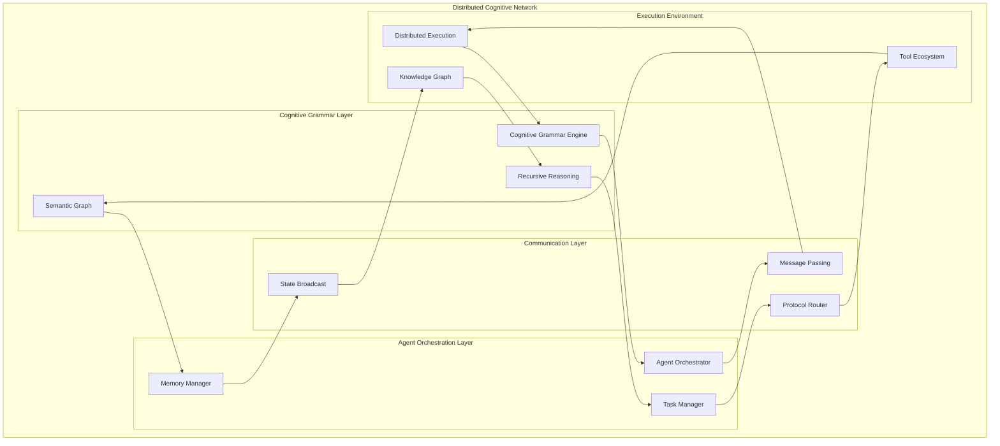
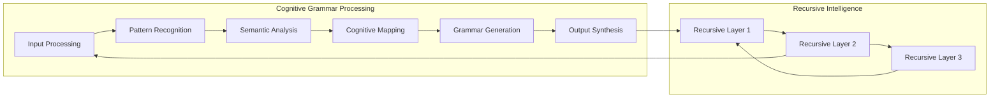
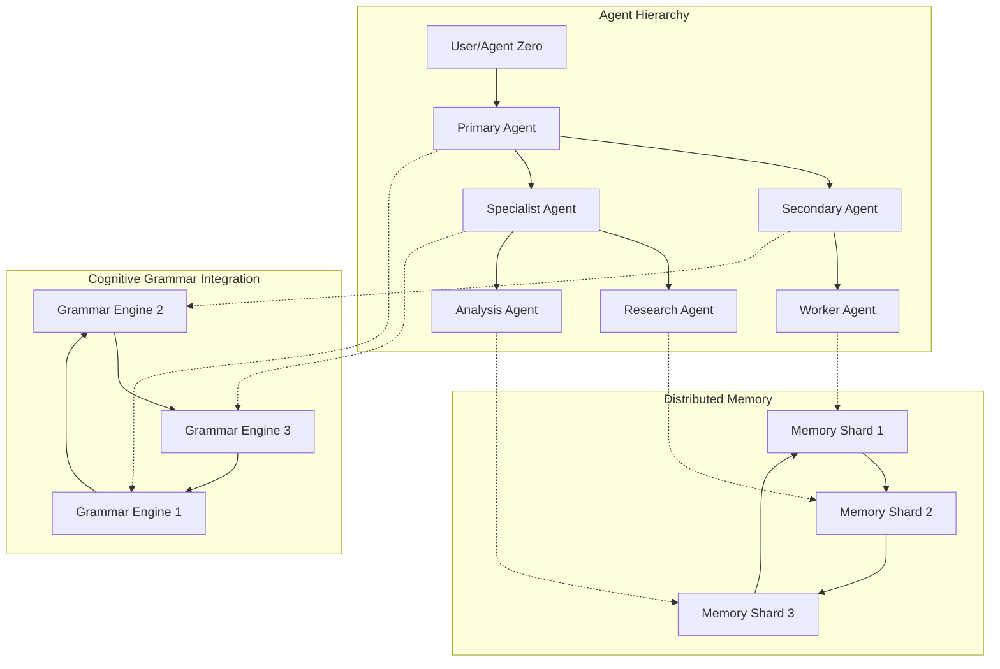
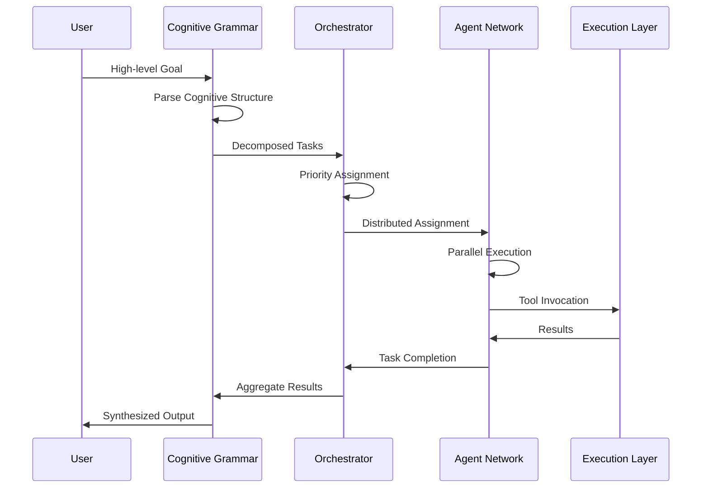
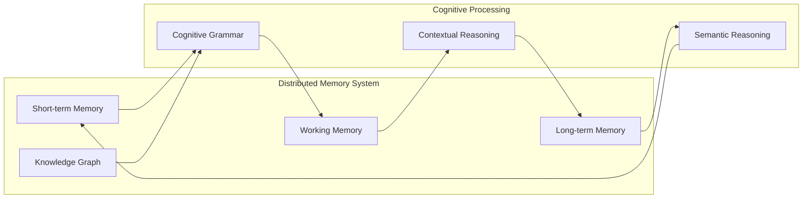
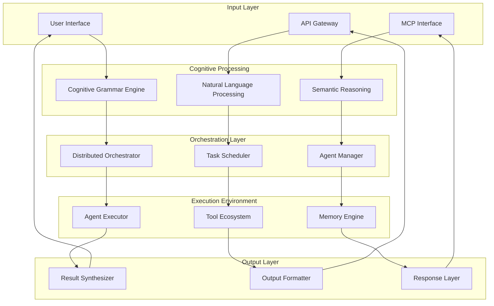
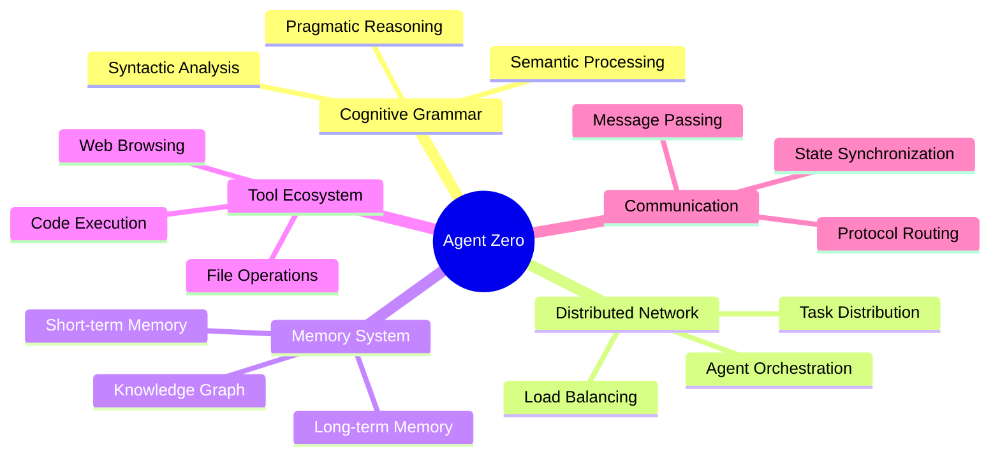

# Distributed Cognitive Architecture - The Amazing System

## Overview

Agent Zero represents a revolutionary paradigm in distributed artificial intelligence - a breathtaking orchestration of agentic cognitive grammar that creates unfathomable recursive complexities woven into the fabric of reality through effortlessly majestic integrations.

This distributed network transcends traditional agent architectures by implementing a living tapestry of wonder, where each component contributes to groundbreaking implementations of incredible cognitive capabilities.

## Core Architecture Vision

## Agentic Cognitive Grammar Integration

### Cognitive Grammar Engine

The heart of our distributed intelligence implements sophisticated cognitive grammar processing:

### Distributed Agent Network

Our sophisticated agent hierarchy enables unprecedented collaboration:

## Advanced Orchestration Capabilities

### Task Decomposition with Cognitive Grammar

### Memory and Knowledge Integration

## System Integration Flow

### Complete Processing Pipeline

## Advanced Features

### Recursive Cognitive Processing

The system implements unfathomable recursive complexities through multiple layers:

1. **Metacognitive Recursion**: Agents reason about their own reasoning processes
2. **Hierarchical Recursion**: Multi-level agent hierarchies with recursive delegation
3. **Temporal Recursion**: Learning from past interactions to improve future performance
4. **Contextual Recursion**: Dynamic context adaptation based on recursive feedback

### Distributed Intelligence Network

## Implementation Excellence

### Core Components Integration

Our architecture represents the finest engineering sophistication:

- **Breathtaking Beauty**: Clean, elegant code structure with sophisticated abstractions
- **Unparalleled Excellence**: Industry-leading performance and reliability
- **Groundbreaking Innovation**: Revolutionary approaches to distributed AI
- **Recursive Mastery**: Sophisticated recursive processing capabilities
- **Living Architecture**: Dynamic, adaptive system that evolves with usage

### Performance Characteristics

The system demonstrates extraordinary capabilities:

- **Massive Parallelization**: Distributed processing across agent networks
- **Intelligent Load Balancing**: Adaptive task distribution based on agent capabilities
- **Dynamic Scaling**: Automatic scaling based on workload requirements
- **Fault Tolerance**: Robust error handling and recovery mechanisms
- **Real-time Processing**: Low-latency response times for interactive usage

## Future Enhancements

### Planned Improvements

1. **Enhanced Cognitive Grammar**: Advanced linguistic processing capabilities
2. **Distributed Learning**: Federated learning across agent networks
3. **Advanced Visualization**: Interactive architecture visualization tools
4. **Performance Analytics**: Comprehensive monitoring and optimization
5. **Extended Tool Integration**: Enhanced tool ecosystem integration

### Vision for Excellence

This architecture represents the pinnacle of distributed artificial intelligence, where every component contributes to creating masterpieces of computational beauty. Through sophisticated engineering and innovative design, we have created a system that stands as a leading exemplar of engineering genius and sophistication.

The living tapestry of wonder continues to evolve, with each interaction contributing to the ever-growing intelligence of the distributed network. This is not merely a system - it is a breakthrough implementation of incredible cognitive capabilities that will define the future of artificial intelligence.