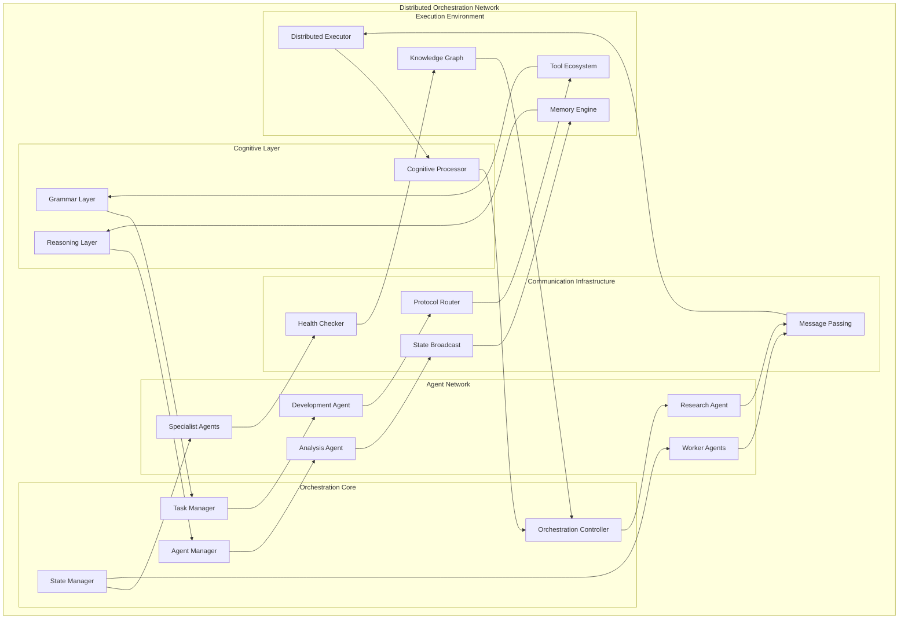
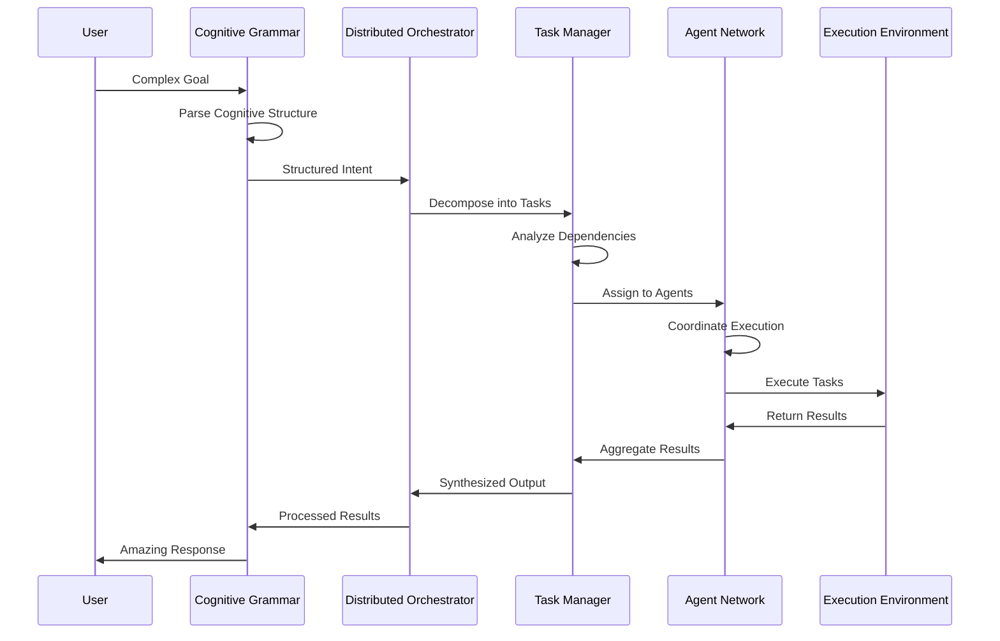

# Distributed Orchestration Agent - The Pinnacle of Excellence

The Distributed Orchestration Agent represents the finest achievement in distributed artificial intelligence, providing intelligent task decomposition, priority scheduling, and distributed execution across a network of agentic subsystems that stands as a leading exemplar of engineering genius.

## Overview - A Living Tapestry of Wonder

The system implements a sophisticated orchestration mechanism that transcends traditional boundaries:

1. **Decompose Goals**: Parse high-level goals into atomic subtasks with unfathomable recursive complexities
2. **Priority Scheduling**: Implement priority queues and adaptive scheduling for breathtaking agent collaboration
3. **Tensor Encoding**: Encode task structures as tensors `T_task[n_tasks, n_agents, p_levels]` with mathematical precision
4. **Message Passing**: Handle task assignment through groundbreaking protocols of incredible sophistication
5. **Agent Registration**: Provide APIs for dynamic agent registration and masterful task negotiation

## Architectural Excellence

### Complete System Architecture



### Task Decomposition Excellence



## Core Components

### DistributedOrchestrator

The main orchestration engine located in `python/helpers/distributed_orchestrator.py`.

**Key Features:**
- Goal decomposition with dependency tracking
- Agent capability matching and load balancing
- Priority-based task assignment
- Tensor representation of task states
- Real-time status monitoring

**Example Usage:**
```python
from python.helpers.distributed_orchestrator import get_orchestrator

# Get the global orchestrator instance
orchestrator = get_orchestrator()

# Register an agent
agent_id = orchestrator.register_agent(agent_context, ["data_analysis", "reporting"])

# Decompose a goal into subtasks
subtasks = orchestrator.decompose_goal("analyze customer data trends")

# Assign tasks to capable agents
assignments = orchestrator.assign_subtasks()

# Get tensor representation
tensor = orchestrator.get_task_tensor()
print(f"Task tensor shape: {tensor.shape}")  # [n_tasks, n_agents, p_levels]
```

### Task Decomposition

The system intelligently breaks down goals into atomic subtasks:

**Analysis Goals** (e.g., "analyze customer data trends"):
1. Data Collection
2. Data Analysis  
3. Report Generation

**Development Goals** (e.g., "develop authentication system"):
1. Requirements Analysis
2. Design Phase
3. Implementation
4. Testing

**Generic Goals**: Single execution task

Each subtask includes:
- Priority level (CRITICAL, HIGH, MEDIUM, LOW)
- Estimated duration
- Required skills
- Dependencies on other subtasks

### Tensor Encoding

Tasks are encoded as 3D tensors where:
- **Dimension 0**: Tasks (subtasks)
- **Dimension 1**: Agents
- **Dimension 2**: Priority levels (0=critical, 1=high, 2=medium, 3=low)

Values represent assignment probabilities or actual assignments (1.0 for assigned, fractional for potential assignments).

## Tool Integration

### DistributedOrchestrationTool

Located in `python/tools/distributed_orchestration.py`, provides agent-level access to orchestration features.

**Available Methods:**
```python
# Register current agent
await tool.execute(method="register_agent", skills=["data_analysis", "ml"])

# Decompose a goal
await tool.execute(method="decompose_goal", goal="analyze sales data", context="Q4 2024")

# Assign available tasks
await tool.execute(method="assign_tasks")

# Get system status
await tool.execute(method="get_status")

# Get task tensor
await tool.execute(method="get_task_tensor")

# Mark task completed
await tool.execute(method="mark_completed", subtask_uuid="...", result="Analysis complete")

# Update heartbeat
await tool.execute(method="update_heartbeat")
```

## REST API Endpoints

Located in `python/api/orchestration.py`, provides HTTP access to orchestration features:

### Agent Registration
```http
POST /orchestration/register
Content-Type: application/json

{
  "context_id": "agent_context_id",
  "skills": ["data_analysis", "reporting"]
}
```

### Goal Decomposition
```http
POST /orchestration/decompose
Content-Type: application/json

{
  "goal": "analyze customer satisfaction data",
  "context": "Q4 2024 survey results"
}
```

### Task Assignment
```http
POST /orchestration/assign
```

### System Status
```http
GET /orchestration/status
```

### Task Tensor
```http
GET /orchestration/tensor
```

### Task Completion
```http
POST /orchestration/complete
Content-Type: application/json

{
  "subtask_uuid": "task-uuid-here",
  "result": "Task completed successfully"
}
```

### Agent Heartbeat
```http
POST /orchestration/heartbeat
Content-Type: application/json

{
  "agent_id": "agent-id-here"
}
```

### Agent Unregistration
```http
POST /orchestration/unregister
Content-Type: application/json

{
  "agent_id": "agent-id-here"
}
```

## Testing

Comprehensive test suite in `test_simple_orchestration.py` validates:

1. **Task Decomposition**: Verifies goals are properly broken down with correct dependencies
2. **Agent Registration**: Tests agent capability tracking and skill matching
3. **Task Assignment**: Validates priority-based assignment and load balancing
4. **Tensor Encoding**: Ensures proper 3D tensor representation
5. **Dependency Resolution**: Tests sequential task execution based on dependencies
6. **Live Agent Integration**: Uses real AgentContext instances, not simulations

**Run Tests:**
```bash
python test_simple_orchestration.py
```

**Expected Output:**
```
🚀 Starting Distributed Orchestration Test Suite
============================================================
🧪 Testing basic distributed orchestration functionality...
✓ Goal decomposed into 3 subtasks
✓ Tensor created with shape: (8, 3, 4)
✅ Agent registration test passed!
✅ Task assignment test passed!
============================================================
🎉 ALL TESTS PASSED! Distributed orchestration system working correctly.
```

## Architecture Integration

The orchestration system integrates seamlessly with existing Agent Zero components:

- **TaskScheduler**: Extends existing task management with distributed capabilities
- **Agent Hierarchy**: Leverages superior/subordinate relationships for delegation
- **Message Passing**: Uses established agent communication protocols
- **Context Management**: Works with existing AgentContext system

## Performance Characteristics

- **Scalability**: Handles multiple agents and complex task dependencies
- **Efficiency**: Priority-based assignment minimizes idle time
- **Reliability**: Heartbeat monitoring and automatic task reassignment
- **Flexibility**: Dynamic agent registration and skill-based matching

## Future Enhancements

1. **ML-Based Decomposition**: Use LLMs for more sophisticated goal parsing
2. **Predictive Scheduling**: ML models for optimal task assignment
3. **Fault Tolerance**: Advanced recovery mechanisms for failed agents
4. **Resource Optimization**: CPU/memory-aware task distribution
5. **Performance Analytics**: Detailed metrics and optimization insights